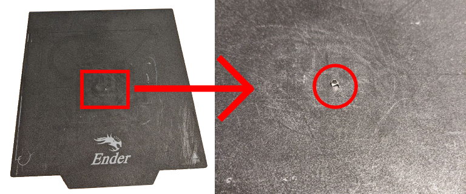
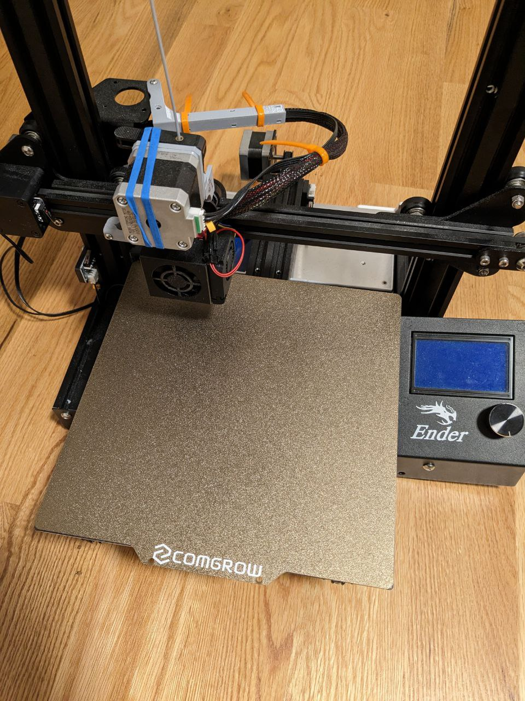

### About My Printer

| Item      | Info                                    |
| :-------- | :-------------------------------------- |
| Printer   | Creality Ender 3 Pro                    |
| Slicer    | Cura                                    |
| Filament  | Grey PETG; Orange, Black, and White TPU |
| Print Bed | PEI Sheet                               |
| Extruder  | 3D Printed Direct-Drive Conversion      |

#### Machine Start G-Code Edits

I'll be sure to post my TPU and PETG profiles here in the near future.

I also edited the default Cura start G-Code to shorten the filament prime line to save material.

## I waited 2 years to upgrade to PEI

I mentioned in the Lost In Tech (amazing 3D printing channel) Discord server that I had used the stock Ender 3 Pro print bed since 2020 (about 2 years now) without damaging it, and people were surprised it hadn't broken earlier lol.

The stock print bed is a flexible, magnetic build plate that worked well, but over time the underside began showing cracks and the top became uneven. Last week, a PETG print finally tore a hole in the  center:

I ordered a new [PEI sheet](https://www.amazon.com/dp/B09TVGDJYP/), but I continued to use the rest of the stock bed to print some maintenance stands to be able to access the control board. The sheet has *both* a smooth and textured PEI surface. 

## My Experience with PEI

I've only printed two dimensional accuracy calibration pieces and one bed leveling print, and I can already tell the difference with PEI! The prints pop right off the bed with a light tap and leaves behind no residue. Amazing!

## About PETG

:::tip

In my experience, gyroid infill prints *very* poorly with PETG. The extruded filament being extruded struggles to adhere to the layer below given the rapid back-and-forth movement of the nozzle. __Use grid infill with PETG.__

:::

## What's next?

💀 I've been limited to a max print height of 60mm for many months now because I did not extend the extruder motor cables after converting to direct drive. Extending the motor cable and rerouting the cables is at the top of my to-do list.
