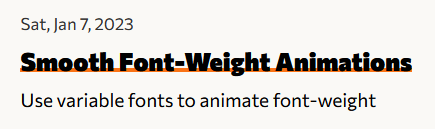

#### Fixing jarring font-weight animation

Welcome to my first blog post! [svelte-QWER](https://github.com/kwchang0831/svelte-QWER), the project powering my blog, uses CSS transitions on the blog post titles (shown below), but the font was not transitioning smoothly between 100 and 900 font weight. I think the author did not use a variable font, so that's what I'll be adding.

Here's are two articles on using variable fonts on the web from CSS-Tricks:

- [One File, Many Options: Using Variable Fonts on the Web](https://css-tricks.com/one-file-many-options-using-variable-fonts-web/)
- [#259: How to use variable fonts](https://css-tricks.com/newsletter/259-how-to-use-variable-fonts/)

It took me 30 minutes or so to figure out how to use them and get a single .woff2 file from Google Fonts, so I guess I'm also writing this as reference for the future.

##### Different apparent font weight between browsers

~~I've now learned that font-weights can look very different between Firefox and Microsoft Edge (and thus Chrome). Not sure why yet, but I'll look into it. `font-weight: 900` is significantly bolder on Firefox than Edge 🤔 and _does_ look much better on Firefox.~~

<ImgZoom src="/web-dev/font-weight-transitions/firefox-font-weight.png" alt="Image of font weight on Firefox browser" class="h-full object-cover">Font weight on Mozilla Firefox</ImgZoom>
<ImgZoom src="/web-dev/font-weight-transitions/edge-font-weight.png" alt="Image of font weight on Microsoft Edge browser" class="h-full object-cover">Font weight on Microsoft Edge</ImgZoom>




###### Jan 8, 2023 update

Turns out I forgot to add `font-weight: 100 900;` under `@font-face` section; this fixed the transitions on Microsoft Edge and Chrome.

:::caution

Make sure to include `font-weight: 100 900;` inside `@font-face`. This specifies the range that is supported by the font and is _required_ for font-weight transitions.

:::

#### Locally host variable font from Google Fonts

1. Choose a variable font from [Google Fonts](https://fonts.google.com/?vfonly=true)
2. Convert ttf file to woff2. I use [CloudConvert](https://cloudconvert.com/ttf-to-woff2)
3. Add font in stylesheets (shown below using this blog's font as an example):

```css
/// showLineNumber
@font-face {
    font-family: "Commissioner";
    font-weight: 100 900;
    src: url("../fonts/Commissioner-VariableFont_wght.woff2") format("woff2-variations");
}

:root {
  font-family: "Commissioner", sans-serif;
}
```

#### Using CSS transitions on font-weight

```css
/// showLineNumber
h1 {
    font-weight: 100;
    transition: font-weight 0.25s;
}

h1:hover {
    font-weight: 900;
}
```

Thanks for reading!
